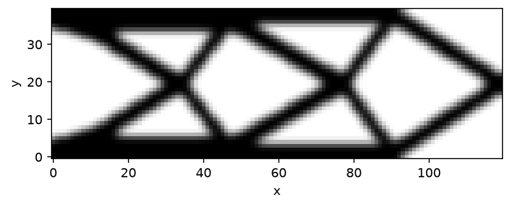
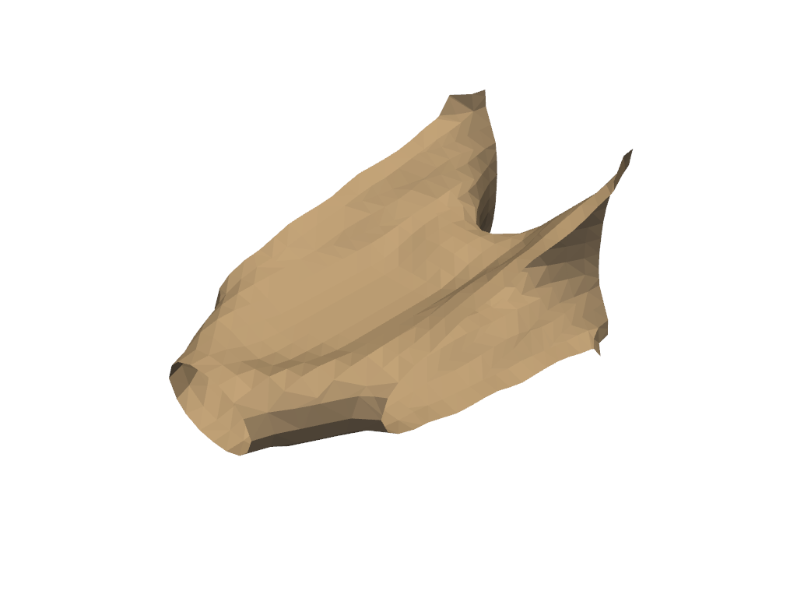

# Gallery

Full-size results, each produced by the exact script shown on its page. Images are regenerated by a committed script (`benchmarks/scripts/gallery.py`), not in CI. The MBB, cantilever, Michell, and 3D cantilever scripts use `RadialDensityFilter`, the literature-faithful Euclidean filter the benchmark references use; the tutorials and the thermal script use `DensityFilter`, its faster separable approximation.

- [MBB beam](mbb.md)

  

- [Cantilever](cantilever.md)

  

- [Michell cantilever](michell.md)

  

- [3D cantilever](cantilever-3d.md)

  

- [Thermal conduction](thermal.md)

  
