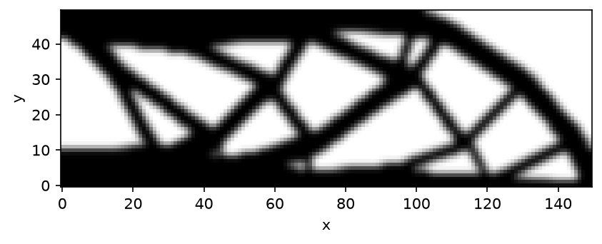

# MBB beam

Half of an MBB beam, exploiting the symmetry of the full beam: a 150x50 domain, x-rollers along the left edge, a vertical support at the bottom-right corner, a downward point load at the top-left corner. Volume fraction 0.5.



Needs the `[viz]` extra (`pip install --pre 'topokit[viz]'`) for `result.view()`. This script runs several minutes at full size; it is not part of the nightly docs harness, but the same physics runs there through the benchmark suite.

<!-- no-run -->
```python
from topokit import (
    OC,
    SIMP,
    Compliance,
    LinearElasticity,
    Material,
    NearPoint,
    PlaneSlab,
    PointLoad,
    Problem,
    RadialDensityFilter,
    Schedule,
    StructuredGrid,
    Study,
    Volume,
)

nelx, nely = 150, 50
mesh = StructuredGrid.box(size=(float(nelx), float(nely)), shape=(nelx, nely))
left = PlaneSlab(point=(0.0, 0.0), normal=(1.0, 0.0), tol=1e-9)
bottom_right = NearPoint((float(nelx), 0.0))
top_left = NearPoint((0.0, float(nely)))
model = LinearElasticity(
    mesh,
    Material(E=1.0, nu=0.3, rho=1.0),
    supports=[(left, "x"), (bottom_right, "y")],
    loads=[PointLoad(top_left, force=(0.0, -1.0))],
)
chain = RadialDensityFilter(radius=2.4) | SIMP(p=3.0)
problem = Problem(
    model, chain, objective=Compliance(), constraints=[Volume() <= 0.5], optimizer=OC(move=0.2)
)
result = Study(problem, schedule=Schedule.default(max_iter=60, tol=1e-3)).run()
print(f"compliance {result.objective:.1f}, {result.iterations} iterations")

fig = result.view()
fig.savefig("mbb.png", dpi=150, bbox_inches="tight")
```
