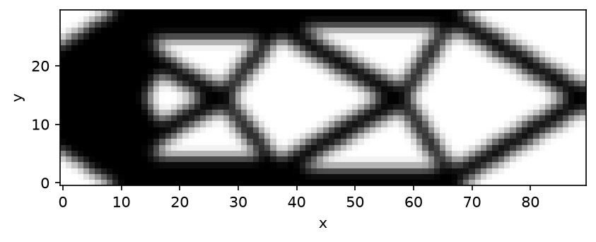

# Michell cantilever

A 90x30 domain with a fixed band along the left edge centered on mid-height, rather than a single point (which would leave a rigid-body rotation unconstrained), and a downward point load at the mid-height of the right edge. Volume fraction 0.5. Support and load are both on the horizontal centerline, so the optimum is mirror-symmetric about it, in the style of Michell's analytical least-weight frames.



Needs the `[viz]` extra (`pip install --pre 'topokit[viz]'`) for `result.view()`. This script runs several minutes at full size; it is not part of the nightly docs harness, but the same physics runs there through the benchmark suite.

<!-- no-run -->
```python
from topokit import (
    MMA,
    SIMP,
    Box,
    Compliance,
    LinearElasticity,
    Material,
    NearPoint,
    PointLoad,
    Problem,
    RadialDensityFilter,
    Schedule,
    StructuredGrid,
    Study,
    Volume,
)

nelx, nely = 90, 30
mesh = StructuredGrid.box(size=(float(nelx), float(nely)), shape=(nelx, nely))
band = Box((0.0, nely / 3.0), (0.0, 2.0 * nely / 3.0), tol=1e-9)
mid_right = NearPoint((float(nelx), nely / 2.0))
model = LinearElasticity(
    mesh,
    Material(E=1.0, nu=0.3, rho=1.0),
    supports=[(band, "all")],
    loads=[PointLoad(mid_right, force=(0.0, -1.0))],
)
chain = RadialDensityFilter(radius=2.4) | SIMP(p=3.0)
problem = Problem(
    model, chain, objective=Compliance(), constraints=[Volume() <= 0.5], optimizer=MMA()
)
result = Study(problem, schedule=Schedule.default(max_iter=60, tol=1e-3)).run()
print(f"compliance {result.objective:.1f}, {result.iterations} iterations")

fig = result.view()
fig.savefig("michell.png", dpi=150, bbox_inches="tight")
```
