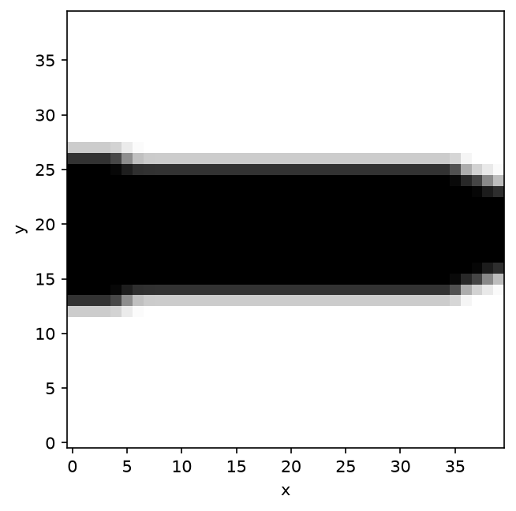

# Thermal conduction

Heat conduction on a 40x40 grid: temperature fixed along the left edge, a unit heat sink at mid-right, one degree of freedom per node. `Compliance` doubles as thermal compliance here; the objective is minimized at volume fraction 0.3. The `HeatConduction` physics model and the `RampConductivity` chain link are developed step by step in [Custom physics](../extend/custom-physics.md); this page reuses them verbatim at full size.



Needs the `[viz]` extra (`pip install --pre 'topokit[viz]'`) for `result.view()`. This script runs several minutes at full size; it is not part of the nightly docs harness, but the same physics is exercised there through the benchmark suite.

<!-- no-run -->
```python
from dataclasses import dataclass
from typing import Any, ClassVar

import numpy as np

from topokit import (
    MMA,
    BoundLink,
    Compliance,
    DensityFilter,
    FieldSpec,
    LinkSpec,
    Problem,
    Schedule,
    StructuredGrid,
    Study,
    Volume,
)
from topokit.backend import SparseMatrix, active_backend

CONDUCTIVITY = FieldSpec("conductivity_scale")


@dataclass(frozen=True)
class RampConductivity(LinkSpec):
    """RAMP-style terminal interpolation for conduction."""

    q: float = 3.0
    scale_min: float = 1e-3
    is_terminal: ClassVar[bool] = True

    def build(self, mesh):
        return _BoundRamp(self.q, self.scale_min)


class _BoundRamp(BoundLink):
    out_field = CONDUCTIVITY

    def __init__(self, q, smin):
        self.q, self.smin = q, smin

    def apply(self, x):
        return self.smin + (1.0 - self.smin) * x / (1.0 + self.q * (1.0 - x))

    def pullback(self, x, g):
        d = (1.0 + self.q) / (1.0 + self.q * (1.0 - x)) ** 2
        return g * (1.0 - self.smin) * d


class HeatConduction:
    """2D conduction on a structured grid: temperature fixed on the left edge,
    a unit heat sink at mid-right, one degree of freedom per node."""

    expected_field: ClassVar[FieldSpec] = CONDUCTIVITY

    def __init__(self, mesh: StructuredGrid) -> None:
        self._mesh = mesh
        hx, hy = mesh.spacing
        r = hx / hy
        a, b = r / 3.0, 1.0 / (3.0 * r)
        self._ke = np.array(
            [
                [a + b, -a + b / 2, -a / 2 - b / 2, a / 2 - b],
                [-a + b / 2, a + b, a / 2 - b, -a / 2 - b / 2],
                [-a / 2 - b / 2, a / 2 - b, a + b, -a + b / 2],
                [a / 2 - b, -a / 2 - b / 2, -a + b / 2, a + b],
            ]
        )
        nx = mesh.shape[0]
        fixed = np.zeros(mesh.n_nodes, dtype=bool)
        fixed[:: nx + 1] = True
        self._free = np.full(mesh.n_nodes, -1, dtype=np.int64)
        self._free[~fixed] = np.arange((~fixed).sum())
        self._n_dof = int((~fixed).sum())
        edofs = self._free[mesh.element_nodes]
        rows = np.repeat(edofs, 4, axis=1).ravel()
        cols = np.tile(edofs, (1, 4)).ravel()
        keep = (rows >= 0) & (cols >= 0)
        self._rows, self._cols, self._keep = rows[keep], cols[keep], keep
        f = np.zeros(self._n_dof)
        sink = int(nx + (nx + 1) * (mesh.shape[1] // 2))
        f[self._free[sink]] = 1.0
        self._loads = f[:, None]

    @property
    def mesh(self):
        return self._mesh

    @property
    def n_dof(self):
        return self._n_dof

    @property
    def n_cases(self):
        return 1

    def assemble(self, scale: Any) -> SparseMatrix:
        vals = np.einsum("e,k->ek", np.asarray(scale), self._ke.ravel()).ravel()[self._keep]
        return active_backend().coo_to_csr(
            self._rows, self._cols, vals, shape=(self._n_dof, self._n_dof)
        )

    def loads(self):
        return self._loads

    def element_energies(self, u, scale):
        uu = np.append(np.asarray(u), 0.0)
        idx = np.where(self._free[self._mesh.element_nodes] >= 0,
                       self._free[self._mesh.element_nodes], self._n_dof)
        ue = uu[idx]
        return np.einsum("ei,ij,ej->e", ue, self._ke, ue) * np.asarray(scale)

    def element_stress(self, u, scale):
        return np.zeros(self._mesh.n_elements)


mesh = StructuredGrid.box(size=(40.0, 40.0), shape=(40, 40))
problem = Problem(
    HeatConduction(mesh),
    DensityFilter(radius=1.5) | RampConductivity(),
    objective=Compliance(),
    constraints=[Volume() <= 0.3],
    optimizer=MMA(),
)
result = Study(problem, schedule=Schedule.default(max_iter=60, tol=1e-3)).run()
print(f"thermal compliance {result.objective:.2f}, {result.iterations} iterations")

fig = result.view()
fig.savefig("thermal.png", dpi=150, bbox_inches="tight")
```
