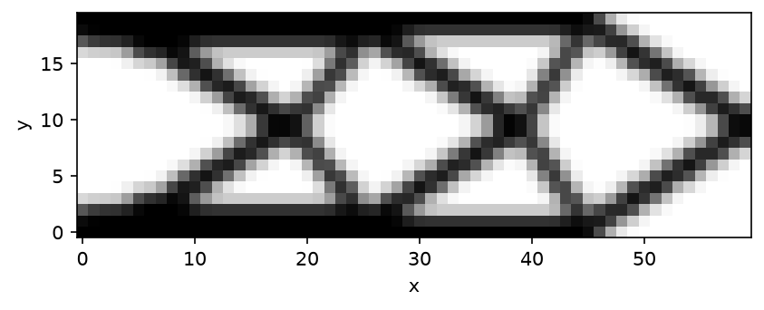

# TopoKit

Open-source topology optimization for engineers.

Install with `pip install --pre topokit` (pre-alpha, published as a dev release).

A 60x20 cantilever, left edge fixed, downward tip load, runs in about 15 s:

```python
from topokit import (
    MMA,
    SIMP,
    Compliance,
    DensityFilter,
    LinearElasticity,
    Material,
    NearPoint,
    PlaneSlab,
    PointLoad,
    Problem,
    StructuredGrid,
    Study,
    Volume,
)

mesh = StructuredGrid.box(size=(60.0, 20.0), shape=(60, 20))
model = LinearElasticity(
    mesh,
    Material(E=1.0, nu=0.3, rho=1.0),
    supports=[(PlaneSlab(point=(0.0, 0.0), normal=(1.0, 0.0)), "all")],
    loads=[PointLoad(NearPoint((60.0, 10.0)), force=(0.0, -1.0))],
)
chain = DensityFilter(radius=1.5) | SIMP()
problem = Problem(
    model, chain, objective=Compliance(), constraints=[Volume() <= 0.4], optimizer=MMA()
)
result = Study(problem).run()  # SIMP continuation on by default

result.design.save("cantilever.npz")
print(f"compliance {result.objective:.1f} after {result.iterations} iterations")
```

The nightly suite executes this snippet; if it drifts from the code, CI fails.



- [Your first 2D part](tutorials/first-2d.md)
- [Gallery](gallery/index.md)
- [Extend](extend/index.md)

## What it is

TopoKit is a density-based topology optimization library: it drives a design variable per element toward 0 or 1 to minimize an objective (compliance, most commonly) under a volume constraint, subject to the physics of a `PhysicsModel` (linear elasticity is built in). Optimization runs through OC or MMA on structured 2D or 3D grids. Every gradient in the built-in responses, chain links, and physics is finite-difference verified in CI. TopoKit is MIT licensed.
